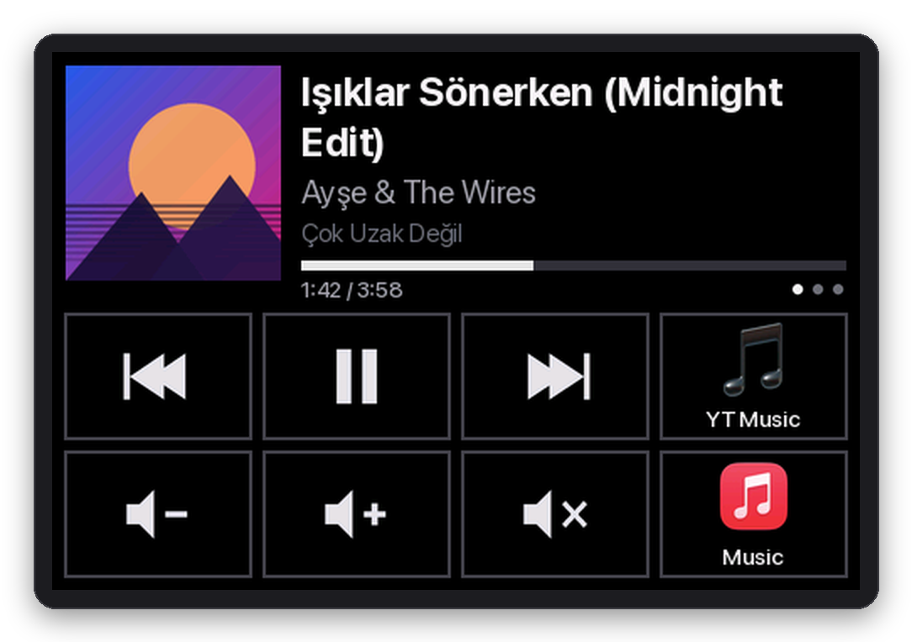
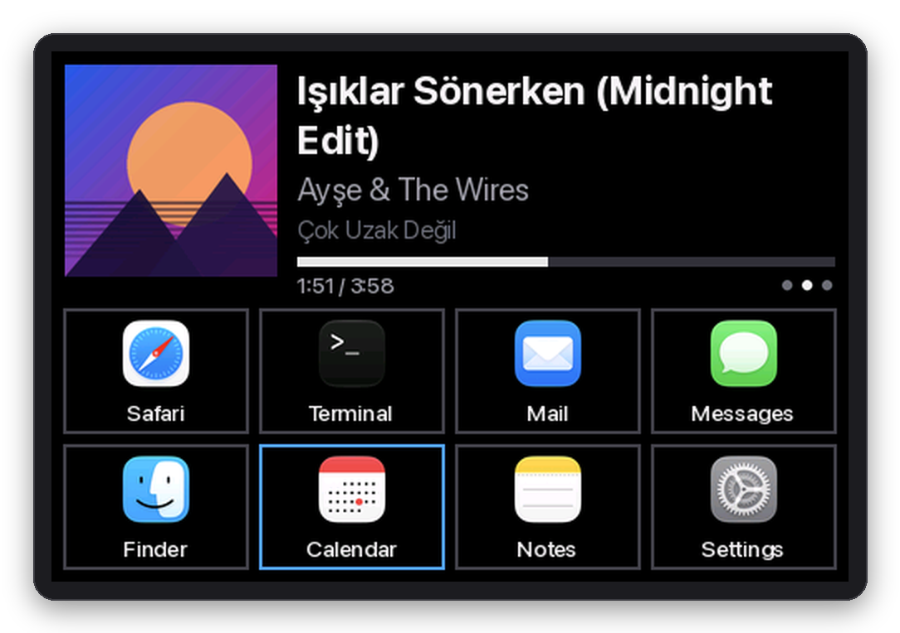
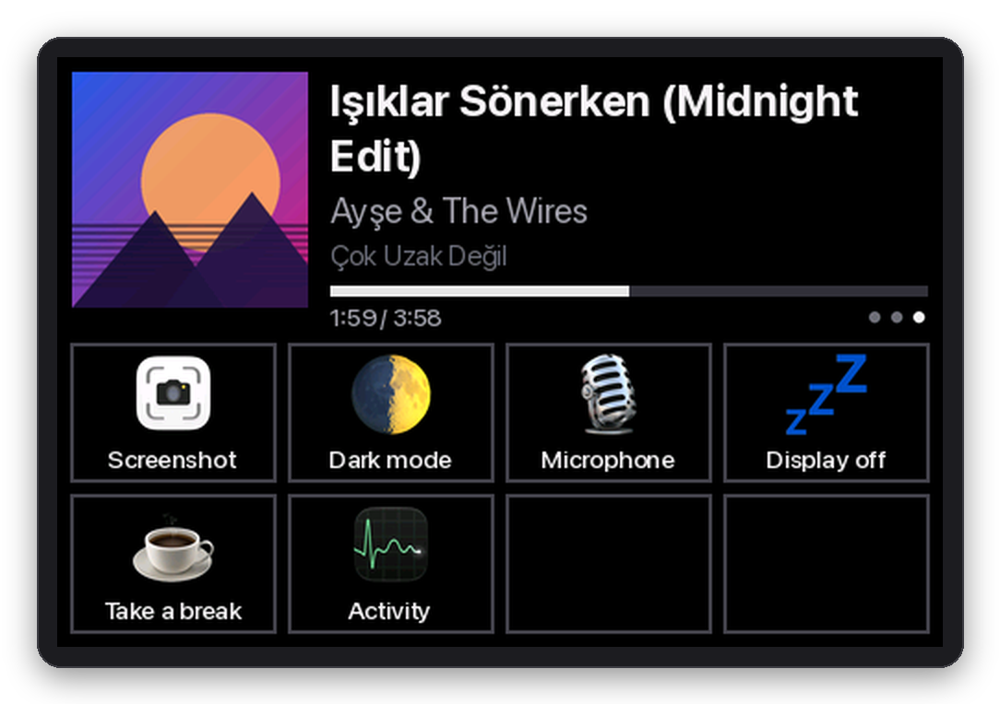
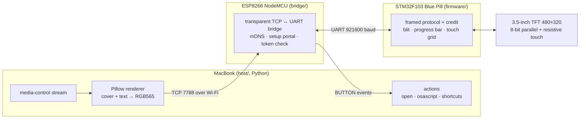
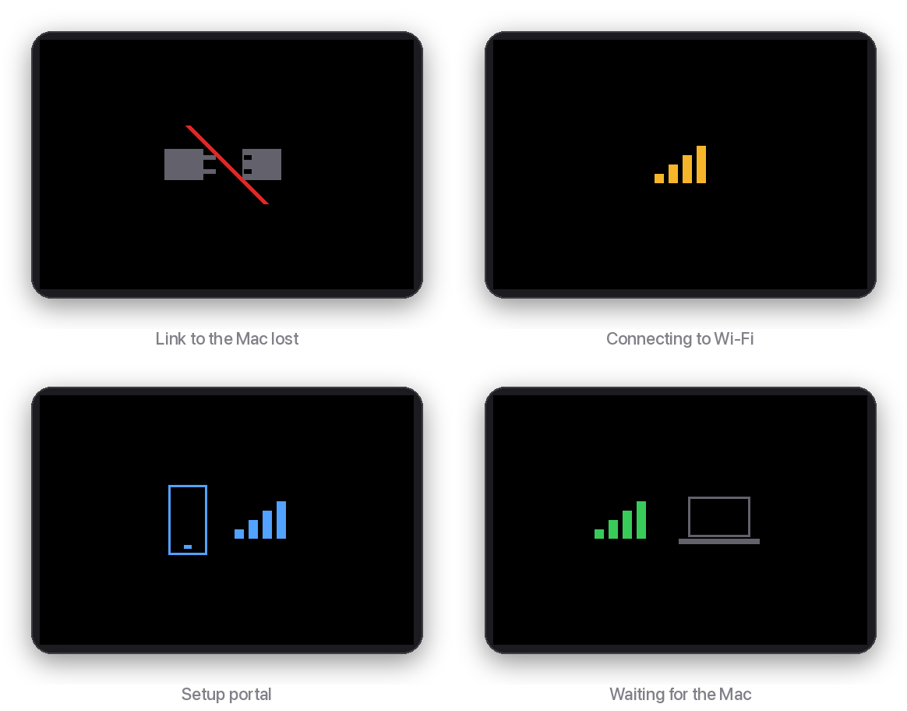

<h1 align="center">deskdeck</h1>

<p align="center">
  <b>A wireless "now playing" display and Stream Deck–style control pad for your Mac,<br>
  built from a Blue Pill, an ESP8266 and a cheap 3.5" TFT shield.</b>
</p>

<p align="center">
  <a href="https://github.com/fatihkonuk/deskdeck/actions/workflows/build.yml"></a>
  <a href="LICENSE"></a>
  
  
  
</p>

<p align="center">
  
</p>

deskdeck sits on your desk, connects to your MacBook over **Wi-Fi** and needs nothing but a USB power
supply. It shows what is playing (cover art, title, artist and a live progress bar), gives you media
keys, and turns the bottom half of the screen into pages of touch buttons that launch apps, open URLs,
run AppleScript or trigger Shortcuts.

## Features

- **Now playing**: cover art, title, artist, album and a progress bar for whatever macOS reports as
  now playing, such as YouTube Music in the browser. Updates within ~0.5 s of a track change.
- **Media controls**: previous / play-pause / next, volume up/down (repeats while held) and mute.
- **Shortcut pages**: a 4×2 touch grid per page, swipe left/right to switch. Buttons can run
  `open -a`, `open`, `osascript` or `shortcuts run`, and show app icons, emoji or your own images.
- **Hot reload**: edit `config.toml` and the pages update on the device as soon as you save.
- **Any script**: text is rendered on the Mac, so Turkish, Greek, Cyrillic, CJK and emoji all just work.
- **Wireless and self-healing**: mDNS discovery, automatic reconnection, a Wi-Fi setup portal, a Wi-Fi
  watchdog and mesh roaming on the bridge; starts at login via launchd.
- **Tiny firmware**: about 9 KB of flash and 8 KB of RAM on the STM32, with no framebuffer and no fonts.

<table>
  <tr>
    <td></td>
    <td></td>
  </tr>
  <tr>
    <td align="center">Apps page (Calendar is being pressed)</td>
    <td align="center">System page with emoji and Shortcuts</td>
  </tr>
</table>

> [!NOTE]
> These screenshots are rendered with the host's actual rendering code plus a faithful re-creation of
> what the firmware draws, quantized to RGB565 like the real panel. They are not photos.

## How it works



- **The Mac does the heavy lifting.** Now-playing data comes from
  [`media-control`](https://github.com/ungive/media-control), which works around the MediaRemote
  restrictions in macOS 15.4+. The host renders cover art and text with Pillow and sends only the
  rectangles that changed, as raw RGB565.
- **The ESP8266 is a dumb pipe.** It forwards bytes between TCP and UART without parsing the protocol.
  Its only other jobs are Wi-Fi setup, mDNS (`deskdeck.local`), checking the shared token in the first
  `HELLO` frame, and telling the STM32 about its connection state.
- **The STM32 drives the display.** An 8-bit parallel TFT needs ~13 GPIOs plus two ADC pins for touch,
  which the ESP8266 doesn't have. The STM32 streams incoming pixels straight into display RAM,
  animates the progress bar between updates, draws button frames and press feedback, and reports
  touches and swipes.
- **Flow control fits in 20 KB of RAM.** UART data arrives by DMA into an 8 KB ring buffer. The MCU
  reports the cumulative number of bytes it has consumed, and the host never has more than 7673 bytes
  in flight, so the buffer can't overflow however long a blit takes. See [docs/protocol.md](docs/protocol.md).

When the Mac is away the device shows what is going on:

<p align="center"></p>

## Hardware

| Part | Notes |
|---|---|
| STM32F103C8 "Blue Pill" | 72 MHz Cortex-M3, 20 KB RAM, 64 KB flash |
| ESP8266 NodeMCU v2 | Wi-Fi ↔ UART bridge |
| 3.5" 480×320 TFT, Arduino Uno shield | 8-bit parallel, MIPI DCS controller (ILI9486/9488, ST7796, …), 4-wire resistive touch |
| ST-Link V2 | To flash the STM32 |
| 5 V USB power supply | Powers everything through one cable |

Wiring, pin tables, touch calibration and the bring-up tools are in **[docs/hardware.md](docs/hardware.md)**.

## Getting started

### Prerequisites

- macOS with [Homebrew](https://brew.sh)
- [PlatformIO Core](https://platformio.org/install/cli) (`brew install platformio`)
- [uv](https://docs.astral.sh/uv/) (`brew install uv`)
- [media-control](https://github.com/ungive/media-control): `brew install ungive/media-control/media-control`
- On Apple Silicon: Rosetta 2 for the ESP8266 toolchain (`softwareupdate --install-rosetta`)

### 1. Create a shared token

```sh
python3 -c "import secrets; print(secrets.token_hex(16))"
```

### 2. Flash the ESP8266 bridge

```sh
cp bridge/include/secrets.h.example bridge/include/secrets.h   # paste the token
cd bridge && pio run -t upload                                 # over the NodeMCU's own USB
```

### 3. Flash the STM32

Wire everything as in [docs/hardware.md](docs/hardware.md), connect the ST-Link (SWDIO, SWCLK, GND)
and power the board from USB:

```sh
cd firmware && pio run -t upload
```

> [!IMPORTANT]
> Every touch panel is different. Before using the device, run the touch diagnostic and the 4-point
> calibration described in [docs/hardware.md → Touch](docs/hardware.md#touch), then copy your values
> into `touch_cal_default` in `firmware/src/touch.c`.

### 4. Join Wi-Fi

On first boot the screen shows the setup portal icon. Join the **`DeskDeck-Setup`** network from your
phone and pick your Wi-Fi. To change networks later, hold the NodeMCU's **FLASH** button for 3 s and
release it.

### 5. Run the host

```sh
cd host
cp config.toml.example config.toml   # paste the same token
uv run deskdeck
```

The screen should light up within a few seconds. Once everything works, install it as a login item
that restarts itself if it crashes:

```sh
host/launchd.sh install      # also: restart, status, logs, uninstall
```

> [!TIP]
> The first time, run `uv run deskdeck` from a terminal so macOS can ask for **Local Network** and
> **Automation** permissions. Background agents don't always get the prompt. See
> [docs/troubleshooting.md](docs/troubleshooting.md#macos-host).

## Configuration

`host/config.toml` holds the device address, the token and your pages. Each `[[pages]]` entry is one
screen of up to 8 buttons (row-major: 0–3 top, 4–7 bottom; `{}` leaves a cell empty):

```toml
[[pages]]
name = "Apps"
buttons = [
  { label = "Safari", app = "Safari" },                  # icon taken from the app
  { label = "YT Music", open = "https://music.youtube.com", icon = "🎵" },
  { label = "Dark mode", icon = "🌓", osascript = "tell application \"System Events\" to tell appearance preferences to set dark mode to not dark mode" },
  { label = "Take a break", shortcut = "Take a Break", icon = "~/Pictures/coffee.png" },
  { media = "playpause" },
  {},
]
```

| Action | Value | Runs |
|---|---|---|
| `media` | `prev`, `playpause`, `next`, `vol_down`, `vol_up`, `mute` | `media-control` / volume via `osascript` |
| `app` | application name | `open -a <name>` |
| `open` | URL or file path | `open <target>` |
| `osascript` | one line of AppleScript | `osascript -e <script>` |
| `shortcut` | Shortcuts name | `shortcuts run <name>` |

Optional keys: `label` and `icon` (an emoji/symbol or an image path). Actions run when the finger is
lifted, so a press that turns into a swipe does nothing. The full example is
[`host/config.toml.example`](host/config.toml.example).

If mDNS is unreliable on your network, set a fixed address with `ip = "192.168.1.50"` under `[device]`.

## Performance

Measured on the reference build:

| | |
|---|---|
| UART throughput (921600 baud) | 88.4 KB/s |
| 128×128 cover art (32 KB) | 0.37 s wired, 0.40 s over Wi-Fi |
| Full screen (300 KB) over Wi-Fi | ~80 KB/s |
| Track change → screen updated | ~0.5 s |
| Page switch | ~34 KB, ~0.4 s |
| Full-screen fill on the MCU | 47 ms |
| Touch sampling | every 10 ms |

## Repository layout

```
deskdeck/
├── firmware/   STM32F103 firmware (PlatformIO, STM32Cube HAL)
│               env:bluepill = the app, env:harness = display/touch bring-up
├── bridge/     ESP8266 Wi-Fi ↔ UART bridge (PlatformIO, Arduino)
├── host/       macOS service (Python 3.12+, uv): now playing, rendering, actions, launchd
├── tools/      SWD bring-up helpers (chip probe, display patterns, touch diagnostic/calibration)
└── docs/       hardware.md · protocol.md · troubleshooting.md
```

## Development

- **Host tests**: `cd host && uv run pytest`. They need no device, `media-control` or macOS fonts, and
  run in CI on every push.
- **Wired protocol test** without Wi-Fi: use the NodeMCU as a USB-serial adapter and run
  `uv run deskdeck-wiretest --image cover.png` (setup in [docs/hardware.md](docs/hardware.md#wired-test-setup-no-wi-fi)).
  `--wifi` runs the same test through the bridge, and `--full image.png` stress-tests flow control.
- **Bridge log**: `sleep 60 | nc deskdeck.local 23`.
- **Bridge status**: `echo -n 'deskdeck?' | nc -u -w1 deskdeck.local 7789`.
- **Host log** when running under launchd: `host/launchd.sh logs` (`~/Library/Logs/deskdeck.log`).
- The screen layout constants exist twice, in `firmware/include/ui.h` and `host/deskdeck/layout.py`, and
  the protocol constants in `firmware/include/proto.h` and `host/deskdeck/protocol.py`. Keep each pair in sync.

## Ideas

- A rotary encoder for volume
- A clock and weather page (NTP on the ESP8266), shown while the Mac sleeps

## License

[MIT](LICENSE) © Fatih Konuk
